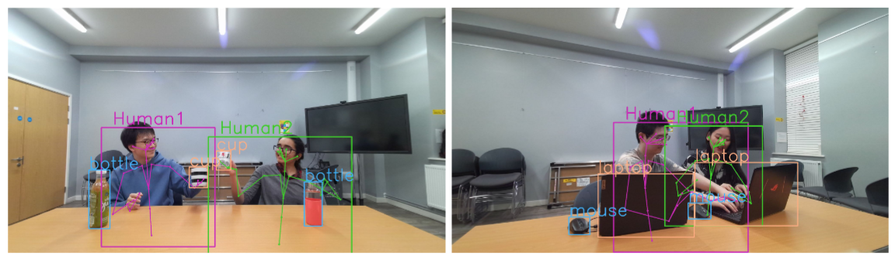
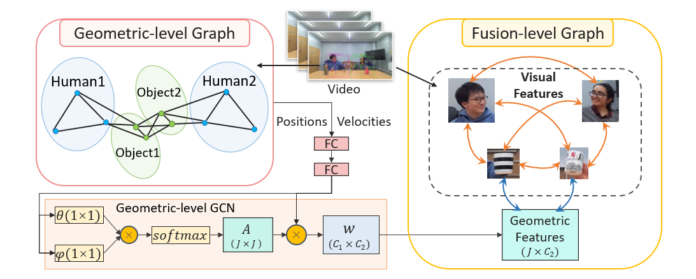

# Multi-person Human-object Interaction Recognition in Videos
Code for the ECCV'22 paper "Geometric Features Informed Multi-person Human-object Interaction Recognition in Videos".




## Environment Setup
First please create an appropriate environment using conda: 

> conda env create -f environment.yml

> conda activate vhoi

## Download Data
Please download the necessary data from the link below, and put the 
downloaded data folder in this current directory (i.e. `./data/...`).

Link: [data](https://drive.google.com/drive/folders/1yfwItIoQrAnbnk5GTjbbfN8Ls8Ybl_hr?usp=sharing).

## Train the Model
To train the model from scratch, edit the `./conf/config.yaml` file, and depending on the selected dataset and model, also 
edit the associated model .yaml file in `./conf/models/` and the associated dataset .yaml file in `./conf/data/`. After 
editing the files, just run `python train.py`.

## Test the Model
Examples on MPHOI-72: when you get pre-trained models for all subject groups, you can get the cross-validation result by `python -W ignore predict.py --pretrained_model_dir ./outputs/mphoi/2G-GCN/hs512_e40_bs8_lr0.0001_0.1_Subject14 --cross_validate`.

## Citation
If you use our code or data, please cite:
```
@inproceedings{qiao2022geometric,
    title={Geometric Features Informed Multi-person Human-object Interaction Recognition in Videos},
    author={Qiao, Tanqiu and Men, Qianhui and Li, Frederick W. B. and Kubotani, Yoshiki and Morishima, Shigeo and Shum, Hubert P. H.},
    booktitle={European Conference on Computer Vision (ECCV)},
    year={2022}
}
```
